# **Python Virtual Assistant Task**

## How may I assist you today?

The live link can be found <a href="https://virtual-assistant-task-py.herokuapp.com/" target="_blank" rel="noopener">here</a>.

This project was created as part of the Full Stack Software Development course offered by Code Institute.

## Table of Contents

- [**Python Virtual Assistant Task**](#python-virtual-assistant-task)
  - [How may I assist you today?](#how-may-i-assist-you-today)
  - [Table of Contents](#table-of-contents)
  - [Introduction](#introduction)
  - [UX](#ux)
    - [Overview](#overview)
    - [Why a Python Virtual Assistant Task?](#why-a-python-virtual-assistant-task)
    - [Key Project Goals](#key-project-goals)
  - [Design](#design)
    - [Flowchart](#flowchart)
    - [Design Process](#design-process)
  - [Features](#features)
    - [Screenshots](#screenshots)
  - [User Stories](#user-stories)
    - [Target Audience](#target-audience)
    - [As a Site User I want to...](#as-a-site-user-i-want-to)
    - [As a Developer I want to...](#as-a-developer-i-want-to)
    - [Bugs and Fixes Implemented after Testing](#bugs-and-fixes-implemented-after-testing)
      - [Bugs:](#bugs)
  - [Technologies Used](#technologies-used)
    - [Languages](#languages)
    - [Python Libraries](#python-libraries)
    - [Thrid Party Libraries](#thrid-party-libraries)
  - [Tools](#tools)
  - [Testing](#testing)
    - [Validation of Code Testing](#validation-of-code-testing)
      - [Python](#python)
  - [Deployment](#deployment)
    - [Forking the GitHub Repository and Running this Project Locally](#forking-the-github-repository-and-running-this-project-locally)
    - [Setting up heroku](#setting-up-heroku)
  - [Credits](#credits)
    - [Media](#media)
    - [Acknowledgements](#acknowledgements)
  - [Author](#author)

## Introduction

The purpose of this project is to put into practice the knowledge about the Python language acquired during the course, such as:

 - The use of the Python Language.
 - The use of the Python Virtual Environment.
 - The use of the Python in the Terminal.
 - Creating of variables and assign a value to them.
 - Data Structures.
   - Tuples.
   - Lists.
   - Dictionaries.
   - Sets.
 - Decision Structures.
   - If/Else statements.
 - Repetition Structures.
   - For loop.
   - While loop.
 - Functions.
 - The use of the Python Libraries.
 - and many others.

## UX

### Overview

Python Virtual Assistant Task is a Python terminal application, which runs on a mock terminal on Heroku.

The goal of this Python application is to create a virtual assistant that can be used to perform tasks from the command line. Basically, the virtual assistant will be able to perform tasks like:

 - Add a new task to the list of tasks.
 - List all the tasks in the list.
 - Remove a task from the list of tasks.
 - Restore a task from the list of removed tasks.

### Why a Python Virtual Assistant Task?

We know that nowadays, the vast majority of web applications have a chatbot to help the user in their 
daily tasks. As a result, the idea of ​​developing a virtual task assistant is quite pertinent.Through this application, the user will be able to count on the help of a virtual agent that will help him according to what is requested. If the user wants to add a new task, the agent will do it. And so on.

### Key Project Goals

As a site owner, I would like to provide users an easy and solid backend application.

-----

## Design

### Flowchart

To create the flowchart, I have used the [LucidChart](https://www.lucidchart.com/) tool.

1. #### _Main loop flowchart_

      

Click to view the Maiin Loop flowchart

        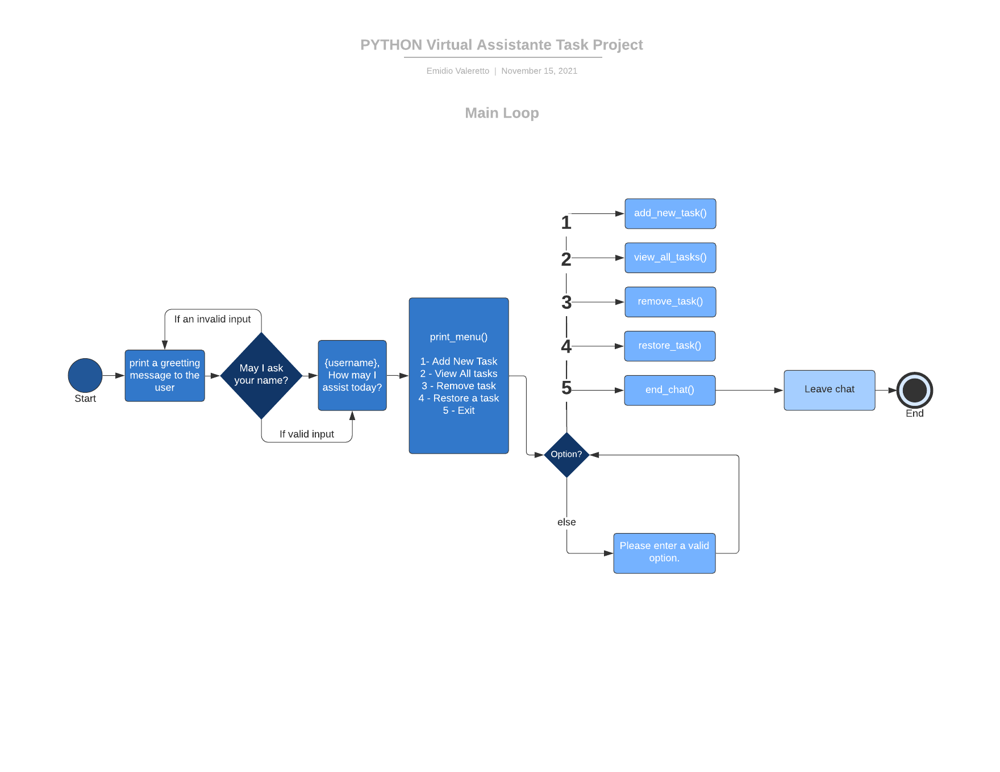
      

2. #### _Start Bot loop flowchart_

      

Click to view the Start Bot loop flowchart

        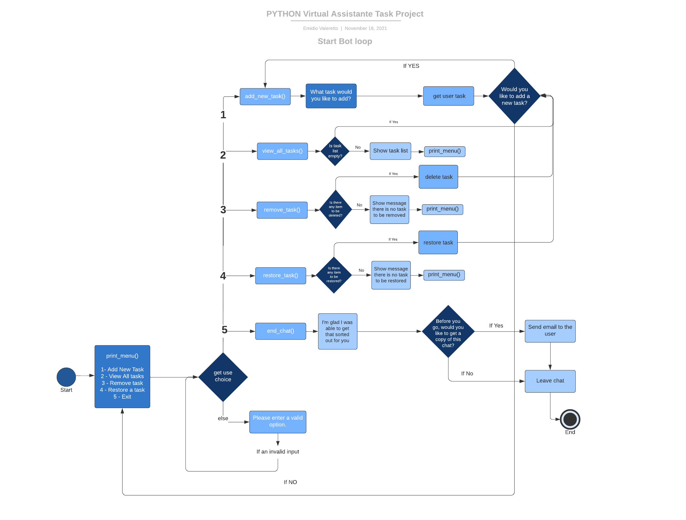
      

### Design Process

1. #### _Strategy Plane_
   
   **User Stories**
   This site is created based on the following user’s expectations in mind.

   * As a first time user I would like to:
     
	 * Have a clear information on what the application is about and what it does
	 * Have an easy understanding about how the application works
	 * Have clear feedback for my action taken within the application 

	* As a site creator we would like :

	  * To provide a safe and friendly application that anyone can use.	  

2. #### _Scope Plane_

	**Features**
	
	 * The application should be user-friendly on all browsers and devices.
	 * Intuitive and user-friendly site that any people can gain and share experiences.
	 * The purpose of the application should be clear immediately.

3. #### _Structure Plane_

	**User Story:**

	> - As a first time visitor to the webapp, I would like to immediately understand its purpose.

	**Acceptance Criteria:**

	* Once the program is run, a welcome message is displayed, making it clear to the user the purpose of the application.

	**Implementation:**

	A welcome message is displayed to the user. E.g. "Welcome to the Python Virtual Task Assistant...".
  Therefore, the user can immediately understand that the purpose of the application is a Virtual Task Assistant.

	**Result:** User Story accomplished.

	**User Stories:**

	> - I would like to be able to choose between adding a task, seeing tasks that have already been added, deleting a task that has already been completed and restore tasks that have been deleted, if I wish to.
	> - I would like the application to be friendly and easy to understand and use.

	**Acceptance Criteria:**

	* User can choose to add a task to a list of new tasks.
	* User can choose to view the list of tasks.
	* User can choose to delete a task that has already been completed. 
	* User can choose to restore a task that has already been deleted.

	**Implementation:**

	Upon the program runs, the application will display a menu with the following options:

    1- Add a task
    2- View tasks
    3- Delete a task
    4- Restore a task

  The user can choose to add a task, view the list of tasks, delete a task, or restore a task, as their preference.

	**Result:** User Story accomplished.

## Features

  This is a list of Irish names that I have used in the application. Each time that the program runs, a random name will be chosen from this list.
  
  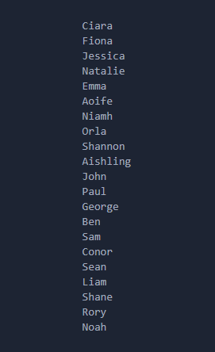 

### Screenshots
 

  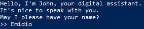

  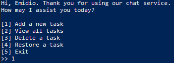

  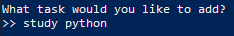

  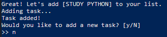

  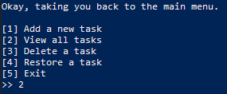

  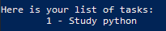

  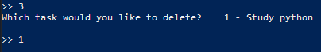

  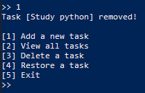

  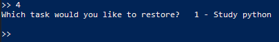

  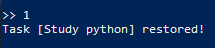

  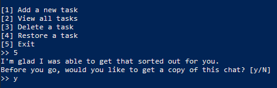

  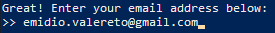

  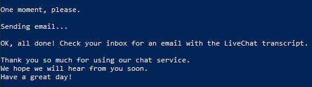

[Back to top ⇧](#table-of-contents)

-----

## User Stories

### Target Audience

1. My target audience is those people who wish to use an application to perform tasks.

### As a Site User I want to...

1. Be able to add a new task, If I wish to.
2. Be able to view all the tasks I have added so far.
3. Be able to delete a task that has already been completed.
4. Be able to restore a task that has already been deleted by mistake.
5. Receive by email a LiveChat transcript of the conversation with the virtual assistant.

### As a Developer I want to...

1. As I develop, I want all the features to be working as expected.
2. I want the user to have the best experience throughout the application. 
3. I want to showcase my skills in Python Programming Language.

[Back to top ⇧](#table-of-contents)

-----

### Bugs and Fixes Implemented after Testing

#### Bugs: 

1. During the deployment of the application, I noticed that the program was not running properly. The email was not being sent to the user, as expected. After reading [Heroku's documentation](https://devcenter.heroku.com/articles/config-vars), I could see that in addition to creating an environment variable that could improve compatibility with various Python libraries (`PORT=8000`), I had to create a new environment variable that communicates with the email service (in this case, the SMTP server from Gmail - `PORT_GMAIL=465`). After that, the program was running properly and the email was being sent to the user.

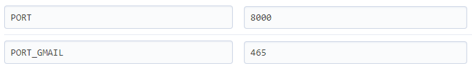

-----

## Technologies Used

### Languages

1. **Python:** Used to develop all application logic. - [python.org/](https://www.python.org/)

### Python Libraries

  - sys: Used to access the command line arguments.
  - os: Used to clean the output of the command line.
  - random: Used to choose a random name from a list of agents names, each time the program is run.
  - datetime: Used to get the current date and time.
  - time.sleep: Used to pause the program for a certain amount of time.
  - ssl: Used to access the SMTP server from Gmail.
  - smtplib: Used to send emails from the application.
  - email.mime.base: Used to create the email message.
  - email.mime.text: Used to create plain text emails.
  - email.mime.multipart: Used to create emails with attachments.
  
### Thrid Party Libraries

  - environs: Used to access the environment variables.
  - pyisemail: Used to validate the email address.

## Tools

1. **Gitpod:** An online IDE also used for creating & saving code that runs in a browser, it does not have to be installed on your PC - 
https://www.gitpod.io/

2. **Git:** A version control system for tracking changes in source code during software development - https://git-scm.com/

3. **Github:** A company that provides hosting for software development version control using Git. It is a subsidiary of Microsoft - https://github.com/

4. **VSCode**: A free and open-source text editor for software development - https://code.visualstudio.com/

5. **Heroku**: A cloud-based platform for deploying and managing web applications - https://www.heroku.com/

6. **Gmail**: A web-based email service that allows users to send and receive email - https://www.gmail.com/

[Back to top ⇧](#table-of-contents)

-----

## Testing

### Validation of Code Testing

  1. If the user enter a wrong input in the beginning of the program (e.g. entering an empty string or a number instead of a string), the program should not crash.
        
      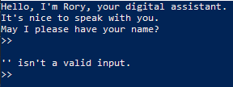

  2. If the user enters a wrong input in the menu options (e.g. entering a number that is not one of the options), the program should not crash.

      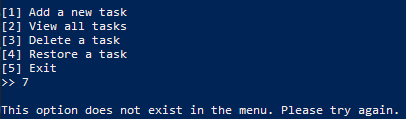

  3. If the user chooses to view the list of tasks and there is no task to be displayed, the program should not crash.

      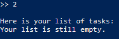

  4. If the user tries to delete a task whose index does not exist, the program should not crash.

      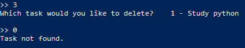

   - It should work the same way for the restore_task() function.

  5. When the user opts out of the conversation, the agent will ask if he wants to receive a copy of the conversation by email. The user is expected to enter [Y] for Yes or [N] for No. If the user enters any other input than these, the program should not crash.

      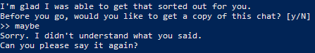

  6. If the user enters a wrong input in the email address field, the program should not crash.

      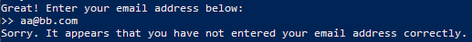

      The function validate_email_address() is used to validate the email address. It receives as parameter the email address and check whether the domain used in the email is a valid domain and whether or not it has a valid MX record. It returns True if the email address is valid and False if it is not.

     ** **Please note that a valid response here is not a guarantee that the email exists, merely that is can exist.** **

  7. If for some reason the program cannot connect to the SMTP server, the program should not crash.

      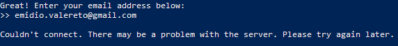

#### Python

 - Application tested using [PEP8 Online Check](http://pep8online.com/) PEP8 Online Check.

  - All code is written in Python 3.10.0

## Deployment

### Forking the GitHub Repository and Running this Project Locally

By forking the GitHub Repository we make a copy of the original repository on our GitHub account to view and/or make changes without affecting the original 
repository by using the following steps...

  1. Log in to GitHub and locate the [GitHub Repository](https://github.com/)

  2. At the top of the Repository (not top of page) just above the "Settings" Button on the menu, locate the "Fork" Button.

  3. You should now have a copy of the original repository in your GitHub account.

  4. Run the index.html file in your local browser.

### Setting up heroku

To set up heroku you must:

  1. If your requirements.txt file has not changed you can skip this step. Otherwise, in your terminal type 'pip freeze > requirements.txt' then save and push the changes.
  2. Go to Heroku.com and sign in or create a free account.
  3. From the heroku dashboard click the 'Create new app' button.
  4. Name the app something unique and choose what region you are in then click 'Create app'.
  5. Go to the settings tab and find the Config Vars section. Click 'Reveal Config Vars'.
  6. For this project, you required to add a environment variable to connect to SMTP server from GMAIL. In the field KEY, enter PORT_GMAIL in all capitals, then for VALUE enter 465. (**Note that you must differentiate between PORT and PORT_GMAIL. Otherwise, your deployment may fail**) Then click 'Add'.
  7. In the field for KEY enter PORT in all capitals, then in the field for VALUE enter 8000. Then click 'Add'.
  8. Scroll down to the Buildpacks section and click 'Add buildpack'.
  9. Click Python then save changes.
  10. Add another buildpack by clicking 'Add buildpack' and this time click Nodejs then save changes.
  11. Make sure that Python appears above Nodejs in the buildpack section. If it does not you can click and drag them to change the order.
  12. Then head over to the deploy section by clicking deploy from the nav bar at the top of the page.
  13. From the 'Deployment method' section select GitHub and click 'Connect to GitHub'.
  14. Enter the repository name as it is in GitHub and click 'search'.
  15. Click the 'connect' button next to the repository to link it to heroku.
  16. To deploy, scroll down and click the 'Deploy Branch' button.
  17. Heroku will notify you that the app was successfully deployed with a button to view the app.
  18. If you want to rebuild your app automatically you can also select the 'Enable Automatic Deploys' button which will then rebuild the app every time you push any changes.

-----

## Credits

### Media

- [Table of contents](https://ecotrust-canada.github.io/markdown-toc/)

- [Code Institute](https://codeinstitute.net/)

- [Lucid Chart](https://lucidchart.com/)

- The code to send email is credited to [Real Python](https://realpython.com/python-send-email/)

### Acknowledgements

I would like to take the opportunity to thank:

 - My family, friends and colleagues for their advice, support and help with testing.
 - To my mentor Felipe Alarcon for his feedback, advice, support and, above all, for his patience.
 - All Code Institute Tutors and Community on Slack for the peer reviews and advice.

## Author

Made with ❤️ by <b>Emidio Valereto</b> 👋🏽 Get in touch!

 

[Back to top ⇧](#table-of-contents)