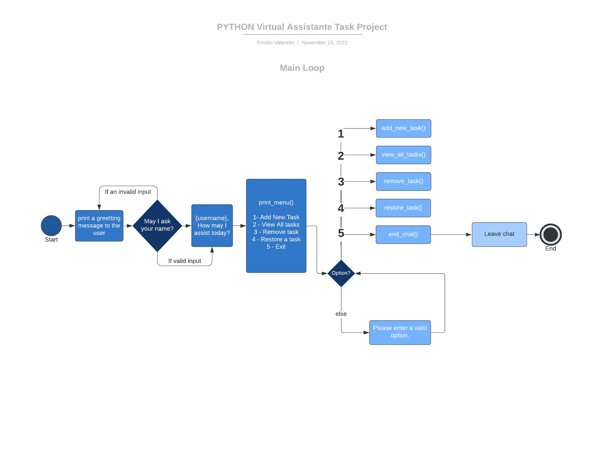

# **Python Virtual Assistant Task**

## How may I assist you today?

The live link can be found <a href="https://virtual-assistant-task-py.herokuapp.com/" target="_blank" rel="noopener">here</a>.

This project was created as part of the Full Stack Software Development course offered by Code Institute.

## Table of Contents

- [**Python Virtual Assistant Task**](#python-virtual-assistant-task)
  - [How may I assist you today?](#how-may-i-assist-you-today)
  - [Table of Contents](#table-of-contents)
  - [Introduction](#introduction)
  - [UX](#ux)
    - [Overview](#overview)
    - [Why a Python Virtual Assistant Task?](#why-a-python-virtual-assistant-task)
    - [Key Project Goals](#key-project-goals)
  - [Design](#design)
    - [Flowchart](#flowchart)
  - [Technologies Used](#technologies-used)
    - [Languages](#languages)
  - [Tools](#tools)
  - [Testing](#testing)
    - [Validation of Code Testing](#validation-of-code-testing)
      - [Python](#python)
  - [Deployment](#deployment)
    - [Forking the GitHub Repository and Running this Project Locally](#forking-the-github-repository-and-running-this-project-locally)
    - [Setting up heroku](#setting-up-heroku)
  - [Credits](#credits)
    - [Media](#media)
    - [Acknowledgements](#acknowledgements)
  - [Author](#author)

## Introduction

The purpose of this project is to put into practice the knowledge about the Python language acquired during the course, such as:

 - The use of the Python Language.
 - The use of the Python Virtual Environment.
 - The use of the Python in the Terminal.
 - Creating of variables and assign a value to them.
 - Data Structures.
   - Tuples.
   - Lists.
   - Dictionaries.
   - Sets.
 - Decision Structures.
   - If/Else statements.
 - Repetition Structures.
   - For loop.
   - While loop.
 - Functions.
 - The use of the Python Libraries.
 - and many others.

## UX

### Overview

Python Virtual Assistant Task is a Python terminal application, which runs on a mock terminal on Heroku.

The goal of this Python application is to create a virtual assistant that can be used to perform tasks from the command line. Basically, the virtual assistant will be able to perform tasks like:

 - Add a new task to the list of tasks.
 - List all the tasks in the list.
 - Remove a task from the list of tasks.
 - Restore a task from the list of removed tasks.

### Why a Python Virtual Assistant Task?

### Key Project Goals

As a site owner, I would like to provide users an easy and solid backend application.

-----

## Design

### Flowchart

To create the flowchart, I have used the [LucidChart](https://www.lucidchart.com/) tool.

1. #### _Main loop flowchart_

2. #### _Start Bot loop flowchart_

## Technologies Used

### Languages

1. **Python:** Used to develop all application logic. - [python.org/](https://www.python.org/)

## Tools

1. **Gitpod:** An online IDE also used for creating & saving code that runs in a browser, it does not have to be installed on your PC - 
https://www.gitpod.io/

2. **Git:** A version control system for tracking changes in source code during software development - https://git-scm.com/

3. **Github:** A company that provides hosting for software development version control using Git. It is a subsidiary of Microsoft - https://github.com/

[Back to top ⇧](#table-of-contents)

## Testing

### Validation of Code Testing

#### Python

 - Application tested using [PEP8 Online Check](http://pep8online.com/) PEP8 Online Check.

## Deployment

### Forking the GitHub Repository and Running this Project Locally

By forking the GitHub Repository we make a copy of the original repository on our GitHub account to view and/or make changes without affecting the original 
repository by using the following steps...

  1. Log in to GitHub and locate the [GitHub Repository](https://github.com/)

  2. At the top of the Repository (not top of page) just above the "Settings" Button on the menu, locate the "Fork" Button.

  3. You should now have a copy of the original repository in your GitHub account.

  4. Run the index.html file in your local browser.

### Setting up heroku

To set up heroku you must:

  1. If your requirements.txt file has not changed you can skip this step. Otherwise, in your terminal type 'pip freeze > requirements.txt' then save and push the changes.
  2. Go to Heroku.com and sign in or create a free account.
  3. From the heroku dashboard click the 'Create new app' button.
  4. Name the app something unique and choose what region you are in then click 'Create app'.
  5. Go to the settings tab and find the Config Vars section. Click 'Reveal Config Vars'.
  6. If your project does not use a creds.json file then skip this step. Otherwise, in the field for KEY enter the value CREDS in all capitals. In the field for VALUE copy and paste the entire contents of your creds.json file from your project. Then click 'Add'.
  7. In the field for KEY enter PORT in all capitals, then in the field for VALUE enter 8000. Then click 'Add'.
  8. Scroll down to the Buildpacks section and click 'Add buildpack'.
  9. Click Python then save changes.
  10. Add another buildpack by clicking 'Add buildpack' and this time click Nodejs then save changes.
  11. Make sure that Python appears above Nodejs in the buildpack section. If it does not you can click and drag them to change the order.
  12. Then head over to the deploy section by clicking deploy from the nav bar at the top of the page.
  13. From the 'Deployment method' section select GitHub and click 'Connect to GitHub'.
  14. Enter the repository name as it is in GitHub and click 'search'.
  15. Click the 'connect' button next to the repository to link it to heroku.
  16. To deploy, scroll down and click the 'Deploy Branch' button.
  17. Heroku will notify you that the app was successfully deployed with a button to view the app.
  18. If you want to rebuild your app automatically you can also select the 'Enable Automatic Deploys' button which will then rebuild the app every time you push any changes.

-----

## Credits

### Media

- [Table of contents](https://ecotrust-canada.github.io/markdown-toc/)

- [Code Institute](https://codeinstitute.net/)

- [Lucid Chart](https://lucidchart.com/)

- The code to send email is credited to [Real Python](https://realpython.com/python-send-email/)

### Acknowledgements

I would like to take the opportunity to thank:

 - My family, friends and colleagues for their advice, support and help with testing.
 - To my mentor Felipe Alarcon for his feedback, advice, support and, above all, for his patience.
 - All Code Institute Tutors and Community on Slack for the peer reviews and advice.

## Author

Made with ❤️ by <b>Emidio Valereto</b> 👋🏽 Get in touch!

 

[Back to top ⇧](#table-of-contents)